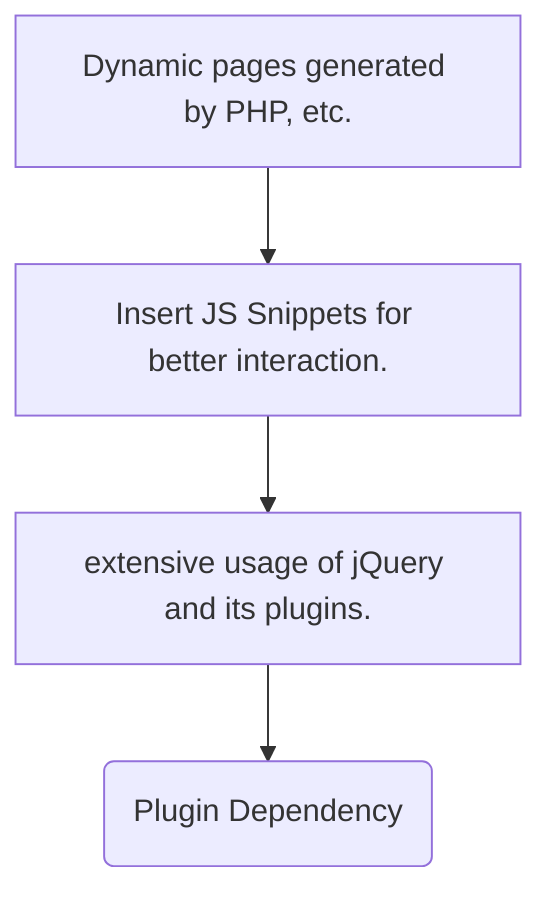
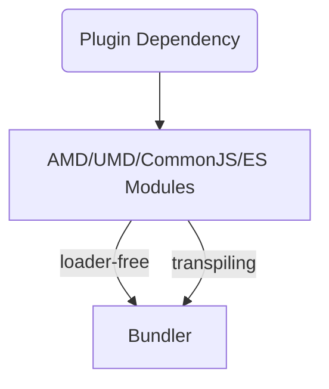

<div>
<h1>Webpack</h1>
bundle your scripts, assets and more
</div>

---
layout: two-cols
class: mx-1
---

## How frontend projects evolved



::right::

```html
<body>
  <!--At the end of body block...-->
  <script src="js/jquery.js"></script> <!--jQuery first-->
  <script src="js/jquery.datepicker-zh-CN.min.js"></script>
  <script src="js/jquery-ui.js"></script>
</body>
```

<v-clicks>

- A Typical webpage using jQuery can load dozens of jQuery plugins.
  - All plugins should be load after jQuery itself, and loading plugins in the correct order can be a hassle
- Since some plugins operates on the DOM, they should be load after the full page is downloaded.
  - use `window.onload`, or `$(function() {})`
- jQuery injects global variables (`window.$`)
- when the script in `<body>` is loading, the page load is blocked. (deferred loading? ordering!)

</v-clicks>

---

## Module Management in Frontend

### Goals to achieve

<v-clicks>

 1. avoid polluting the global namespace (`window` in browsers)
 2. resolve dependencies in the correct order

</v-clicks>

<h3 v-click="3">Async Module Definition</h3>

<v-clicks at="4">

```typescript
declare global {
  function define(callback: (..args: string[]) => void): void;
  function define(deps: string[], callback: (..args: string[]) => void): void;
  function define(id: string, deps: string[], callback: (..args: string[]) => void): void;
}
```

```javascript
(function( factory ) { // code taken from jquery-ui
	if ( typeof define === "function" && define.amd ) {
		// AMD. Register as an anonymous module.
		define([ "jquery" ], factory );
	} else {
		// Browser globals
		factory( jQuery );
	}
}(function( $ ) { /* Implementation Omitted*/ }))
```

</v-clicks>

---

### Async Module Definition

<v-clicks>

- Goal 1 achieved with <abbr title="Immediately Invoked Function Expression">IIFE</abbr>
- Goal 2 achieved with `define` provided by a loader implementing [Async Module Definition](https://github.com/amdjs/amdjs-api) (e.g. RequireJS)

</v-clicks>

<v-click v-after>

### What is IIFE (Immediately Invoked Function Expression)?

> Variables in JavaScript have 3 types of scopes:
> - Global Scope (`Math`, `alert`, etc.)
> - Function Scope (all declarations hoisted to top of function)
> - Block Scope (`let` / `const`)
>
> As shown below, IIFE puts variables in function scope, so they won't 
> accidentally collide with global vars declared by other scripts.
> ```javascript
> (function () {
>   // implementation of script
> })() // then invoke the anonymous function
> ```
>
> AMD uses a variation of IIFE, where a call to `define` is preferred.


</v-click>

<v-click v-after>

All 2 goals achieved, but we need a loader library to load AMD Modules. Better approaches?

</v-click>

---
layout: two-cols
class: mx-1
---

### Bundling Tools written in Node.js

<v-click>



</v-click>

::right::

<v-click v-click="2">

What an AMD Loader cannot do?

</v-click>

<v-clicks>

- reduce the number of JavaScript files needed to be downloaded
  - HTTP/1.1 has Request Pipelining, but it is not always available.
  - opening TCP connections is resource-consuming (handshaking)
  - concatenation / [minification](https://www.cloudflare.com/learning/performance/why-minify-javascript-code/)
- perform transformations on the source code
  - developers may use language features in newer versions of JavaScript, e.g. [Async Functions](https://developer.mozilla.org/zh-CN/docs/Web/JavaScript/Reference/Statements/async_function)
  - tools like [Babel](https://babeljs.io/) will transpile the code into a version that runs on older browsers.
  - use languages other than JavaScript, e.g. [CoffeeScript](https://coffeescript.org/) or [TypeScript](https://www.typescriptlang.org/)

</v-clicks>


---

However, all those things can be done with a **bundler**, which takes **a JavaScript project** as input, and **output 1 or more files** suitable for use in **browser**.

<v-click>

### Concatenation and Minification

Example: source code of https://www.xuetangx.com

</v-click>

<v-click v-click="2">

### Transpiling

Original code using ES6 destructuring

```js
let test = { a: 1, b: 2 }
const { a, b } = test
console.log(a)
```

Transpiled by Babel into IE6-compatible code

```js
"use strict";
var test = { a: 1, b: 2 };
var a = test.a, b = test.b;
console.log(a);
```

</v-click>

---

### Polyfills

<v-clicks>

 - Outdated browsers may lack of modern functionality in JavaScript.
 - A famous example is that all versions of IE doesn't support `Promise` API.
 - Polyfills are pieces of code used to *mimic* the functionality.
 - The most famous polyfill would be [core-js](https://github.com/zloirock/core-js), which is used by Babel.

</v-clicks>

<v-click v-after>

  <a href="http://blog.panda2134.site/polyfill-example/">A Polyfill test page, using Promise.</a>
  <span>Tested on Internet Explorer 8 & Windows XP.</span>
  <a href="https://github.com/panda2134/polyfill-example"><mdi-github style="display:inline;" /></a>

  
  

</v-click>

---

## Other module-related specifications

<v-clicks>

 - CommonJS. It is widely used in Node.js projects. 
   - Use `require` to import dependencies, which blocks until the script is loaded.
   - Assign to `module.exports` to export.
   ```js
   /* some Node.js code using CommonJS modules */
   const fs = require('fs')
   fs.readFile('/etc/fstab', (err, data) => {
     if (err) throw err
     console.log(data)
   })
   module.exports = 'the exported string'
   ```
 - ES2015 Modules. Both `import` statement and `import(url)` is supported. The `import(url)` function returns a promise.
    ```js
    /* ES2015 Module Example Code. DO NOT RUN DIRECTLY. */
    import transform from './transform.js' /* default import */
    import { var1 } from './consts.js' /* import a specific item */
    import('http://example.com/example-module.js').then(() => { console.log('loaded') })
    export const MODE = 'production' /* exported const */
    export default { foo: 'bar' } /* default export */
    ```

</v-clicks>

---

## More on ES2015 Modules

- It came too late! 20 years of its absence witnessed the language being overlooked and teased. 
- The earliest proposal on modules came out in [1999](https://archives.ecma-international.org/1999/TC39WG/991115-futures.htm), as a major topic for ES4. 
- However ES4 [failed](https://cn.history.js.org/part-3.html) and it wasn't until ES6 that native module support came into existence.

---

## Webpack

Up till now, everyone should have learned the capabilities of bundlers by heart. Let's dive into using Webpack!

<v-clicks>

### Basic Conf

Webpack works even if no configuration file is provided. If you want to use it for a hobbyist's project, that's totally fine.

> Recall: a bundler takes a project and output files suitable for browser use.

Our simplest project contains only 1 JavaScript file in `src/index.js`. However, it used 2 libraries, which are located in `node_modules`. Webpack computes the dependency graph and pack them altogether.

</v-clicks>

<v-click after>

### Try it out!

```bash
$ mkdir simple-webpack-proj
$ cd simple-webpack-proj
$ yarn # if you haven't installed yarn (you really should!), run `npm install -g yarn`
$ yarn add canvas-confetti delay
$ yarn add --dev webpack webpack-cli http-server
$ mkdir src dist
```

</v-click>

---

## Configure HTML File

We certainly need a HTML file, which loads the bundled script. `webpack` outputs to `dist/main.js` by default. In the simplest project we load the script manually with a `<script>` tag. Later we'll meet `html-webpack-plugin` which injects the tag into index.html automatically.

### `dist/index.html`
```html {all|9}
<!DOCTYPE html>
<html>
	<head>
		<title>Webpack 101</title>
	</head>
	<body>
		<h1>Webpack Test Page</h1>
		<div id="hint"></div>
		<script src="./main.js"></script> <!--Load main.js after body is loaded-->
	</body>
</html>
```

---

## Write the JavaScript part

Let's implement some interesting effects. Call `canvas-confetti` to throw some confetti on the screen, and wait for a second before throwing more.

### `src/index.js`

```js {monaco}
import confetti from 'canvas-confetti'
import delay from 'delay'

async function main() {
	const hint = document.getElementById('hint')
	while (true) {
		hint.innerText = 'confetti'
		await confetti()
		hint.innerText = 'cooldown'
		await delay(1000)
	}
}

main()
```

---

## Build and Run

```bash
$ yarn webpack --mode production
$ yarn http-server -o dist
```

This should open http://127.0.0.1:8080 in your browser.

<iframe 
  src="/examples/simple-webpack-proj/dist/index.html" 
  width="100%"
  height="50%"
  style="background:white;"/>

---

## Getting Serious

Let's meet configuration files. Put the following code into `webpack.config.js`:

<style>
  iframe {
    height: 80% !important;
  }
</style>

```js {monaco}
module.exports = {
  mode: 'production',
  module: {
    rules: [
      {
        test: /\.m?js$/i, // .js / .mjs
        exclude: /node_modules/,
        use: {
          loader: 'babel-loader', // use babel for compatibility
          options: {
            presets: [
              ['@babel/preset-env', { // https://babeljs.io/docs/en/babel-preset-env
                useBuiltIns: 'usage', // import used polyfills in core-js automatically
                corejs: '3',
                targets: {
                  chrome: '41',
                  ie: '9' // and Promise polyfill will be introduced
                }
              }]
            ]
          }
        }
      },
      {
        test: /\.css$/i, // allows you to import css
        use: ['style-loader', 'css-loader']
      }
    ]
  }
}
```

---

Then install the required loaders, etc.

```bash
$ yarn add core-js@3 regenerator-runtime
$ yarn add --dev babel-loader style-loader css-loader @babel/preset-env @babel/core
```

Write some CSS in `src/assets/main.css`:
<style>
  iframe {
    height: 30% !important;
  }
</style>

```css {monaco}
body {
  margin: 0;
  padding: 0;
  display: flex;
  flex-direction: column;
  justify-content: center;
  align-items: center;
  height: 100vh;
}

#hint {
  margin-top: 2em;
  border-radius: 20px;
  font-size: 32px;
  padding: 1em;
  border: 5px solid #1d78c1;
  background-color: #8dd6f9;
  width: 6em;
  display: grid;
  align-items: center;
  justify-items: center;
}
```

... and import them into `src/index.js`

```js
import confetti from 'canvas-confetti'
import delay from 'delay'
import './assets/main.css'

/* ... */
```

---

Build again, and see the results.

```bash
$ yarn webpack # production mode is already specified in config file
$ yarn http-server -o dist
```

<iframe 
  src="/examples/webpack-conf1/dist/index.html" 
  width="100%"
  height="70%"
  style="background:white;"/>

---

## What's a loader?

Loaders are webpack's way of preprocessing files. They can apply source transformations, load static assets, etc.

- [`babel-loader`](https://webpack.js.org/loaders/babel-loader/) Loads ES2015+ code and transpiles to ES5 using Babel
- [`css-loader`](https://webpack.js.org/loaders/css-loader/) Loads CSS file with resolved imports and returns CSS code
- [`style-loader`](https://webpack.js.org/loaders/style-loader/) Add exports of a module as style to DOM (by dynamically injecting <code>&lt;style&gt;</code> tag)
- <del>`file-loader`/`url-loader`</del> Depreciated in webpack@5. Use [asset modules](https://webpack.js.org/guides/asset-modules/) instead.

### Some Babel Notes
<blockquote>
<code>useBuiltIns: 'usage'</code> will allow babel to include polyfills on-demand.
<p>
In this project, only the following polyfills are added.
<pre>
The corejs3 polyfill added the following polyfills:
  es.object.to-string { "chrome":"41", "ie":"9" }
  es.promise { "chrome":"41", "ie":"9" }
The regenerator polyfill added the following polyfills:
  regenerator-runtime
</pre>
</p>
</blockquote>

---

## Plugins

Plugins are used to extend webpack's functionality. We'll add 2 plugins to our project.

- `HtmlWebpackPlugin`: insert script tag into HTML automatically
- `ProgressPlugin`: show progress when running `webpack`

<v-click>

### Install the plugins

`ProgressPlugin` is a builtin plugin.

```bash
$ yarn add --dev html-webpack-plugin
```

</v-click>

---

Edit `webpack.config.js`:
```js{all|1-2|6-12}
const HtmlWebpackPlugin = require('html-webpack-plugin')
const { ProgressPlugin } = require('webpack')
module.exports = {
  mode: 'production',
  module: {...}, // omitted, too long
  plugins: [
    new HtmlWebpackPlugin({
      template: 'src/index.html',
      scriptLoading: 'blocking'
    }),
    new ProgressPlugin()
  ]
}
```

<v-clicks>

and move `dist/index.html` to `src/index.html`.

Now webpack should be automatically generating `dist/index.html` upon every build, while correctly displaying build progress in percentage.

</v-clicks>

---

Checkout the project code [here](https://github.com/panda2134/simple-webpack-proj) on GitHub.

- `master` branch: configuration-free
- `conf` branch: basic configuration of Babel
- `plugin` branch: with aforementioned plugins installed

---

## Future

<v-clicks>

- No bundlers? Native support of ES Modules via [`<script type="module">`](https://developer.mozilla.org/en-US/docs/Web/JavaScript/Guide/Modules#applying_the_module_to_your_html)
  - Use `import` directly, just like in any other languages!
- Sadly, ES modules aren't compatible with UMD Modules & CommonJS Modules.
  - [Skypack](https://www.skypack.dev) dynamically transpiles latter into ES modules.

</v-clicks>

---

## References

- 🎯 [RequireJS](https://requirejs.org/). Who cares about it now?
- ⚙️ [Asynchronous Module Definition](https://github.com/amdjs/amdjs-api). [UMD](https://github.com/umdjs/umd), which is based on it, is still used by some today
- ⚙️ [CommonJS in Node.js](https://nodejs.org/api/modules.html).
- ⚙️ [ES2015 Modules](https://developer.mozilla.org/en-US/docs/Web/JavaScript/Guide/Modules).
- 🌊 [HTTP/1.x Connection Management](https://developer.mozilla.org/zh-CN/docs/Web/HTTP/Connection_management_in_HTTP_1.x). Important if you want your site to load faster
- 📦 [Webpack](https://webpack.js.org/). Official Website & Documentation
- ↔️ [Babel](https://babeljs.io/).
- 🤔 [CanIUse](https://caniuse.com/). Useful place of browser compatibility data
